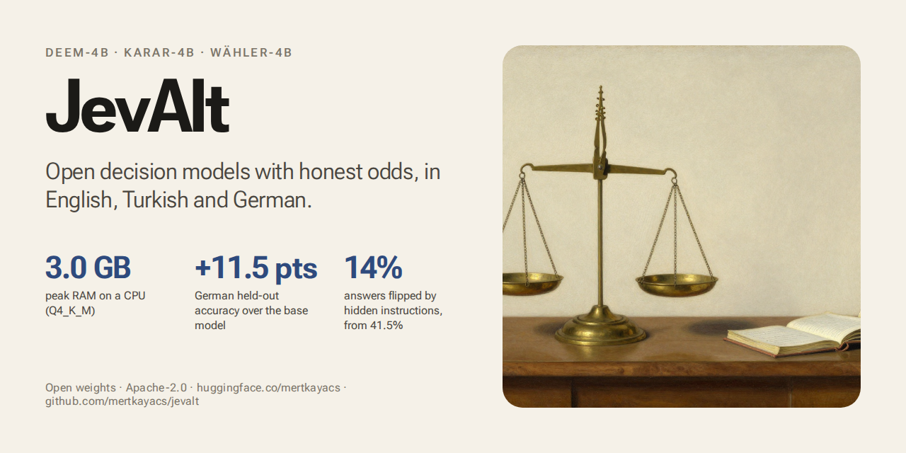
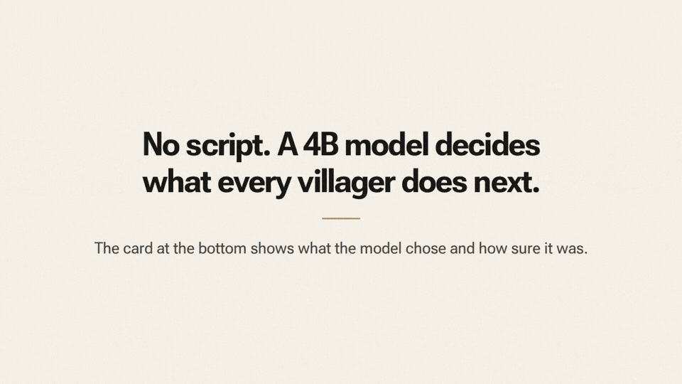

# JevAlt



Open decision models with the Jev API. Calibrated Choice, Score and Noul answers, reasoning when unsure, native Turkish and German, runs offline in about 3 GB of RAM.

[](LICENSE)
[](https://huggingface.co/mertkayacs)
[](https://mertkayacs.github.io/jevalt/)



*Emberwick, a village game where every villager asks Deem-4B what to do next. Nothing is scripted; the card at the bottom shows the choice and how sure the model was.* Also in [Türkçe](https://huggingface.co/datasets/mertkayacs/emberwick-videos/resolve/main/gifs/emberwick-tr.gif) and [Deutsch](https://huggingface.co/datasets/mertkayacs/emberwick-videos/resolve/main/gifs/emberwick-de.gif).

If this is useful to you, a star on GitHub helps other people find it.

## What it is

JevAlt is a family of open 4B decision models that speak TypeSafe's `POST /v1/systemone` API. You send a state and typed questions (Choice, Score, Noul); it returns a calibrated probability for every option. It can reason before it answers, it can say "unknown", and the Q4_K_M build runs on your own machine in 4 GB of RAM (measured peak: 3.0 GB at 4k context). A request that works with Jev works here without changes.

## Models

| Model | Language | Weights | GGUF |
|---|---|---|---|
| Deem-4B | English | [mertkayacs/Deem-4B](https://huggingface.co/mertkayacs/Deem-4B) | [mertkayacs/Deem-4B-GGUF](https://huggingface.co/mertkayacs/Deem-4B-GGUF) |
| Karar-4B | Turkish | [mertkayacs/Karar-4B](https://huggingface.co/mertkayacs/Karar-4B) | [mertkayacs/Karar-4B-GGUF](https://huggingface.co/mertkayacs/Karar-4B-GGUF) |
| Wähler-4B | German | [mertkayacs/Wahler-4B](https://huggingface.co/mertkayacs/Wahler-4B) | [mertkayacs/Wahler-4B-GGUF](https://huggingface.co/mertkayacs/Wahler-4B-GGUF) |

The same Q4_K_M files are on [Kaggle](https://www.kaggle.com/models/mertilovski/jevalt) with a [CPU quickstart notebook](https://www.kaggle.com/code/mertilovski/jevalt-quickstart-calibrated-decisions-on-cpu), and all three models answer in the [Space](https://huggingface.co/spaces/mertkayacs/JevAlt). Each model has a Q4_K_M GGUF file (for example `Deem-4B-Q4_K_M.gguf`) that the `jevalt` server runs on a CPU. The server reads the model's next-token probabilities at each decision, so it is the piece that speaks the Jev API; a plain chat server can load the file but returns text.

## Quickstart

Python 3.11 or newer. A GPU is optional.

```bash
pip install "jevalt[serve,gguf] @ git+https://github.com/mertkayacs/jevalt"
jevalt serve
```

`jevalt serve` downloads Deem-4B on the first run and listens on `http://127.0.0.1:8000`.

Ask a question from a JSON file:

```bash
jevalt ask request.json
```

Or call the server with curl:

```bash
curl -s http://127.0.0.1:8000/v1/systemone \
  -H "Content-Type: application/json" \
  -d '{
    "state": "Hi, my payouts have been failing for 3 days.",
    "questions": {
      "is_urgent": {
        "type": "noul",
        "instructions": "Does this convey urgency?"
      }
    }
  }'
```

To serve a specific model:

```bash
jevalt serve --model mertkayacs/Karar-4B-GGUF --file Karar-4B-Q4_K_M.gguf
```

Request extensions (`reasoning`, `abstain`, `coverage`) and the full API are in the [docs](https://mertkayacs.github.io/jevalt/).

## Results

Each model and the start checkpoint (Intern-Decision-4B) ran through the same client, each with its own temperatures fitted on the calibration splits. The held-out test splits come from the same pipeline as the training rows; TurkishMMLU, GermEval, 10kGNAD and JevBench-hard were never trained on; typed-decisions scores use its test split, and its train split was in the training mix.

| Model | Suite | Decisions | Intern-Decision-4B acc / Brier / ECE | JevAlt acc / Brier / ECE |
|---|---|---|---|---|
| Deem-4B | held-out English | 3,758 | 0.902 / 0.166 / 0.080 | 0.947 / 0.091 / 0.054 |
| Deem-4B | typed-decisions | 2,000 | 0.804 / 0.292 / 0.103 | 0.810 / 0.305 / 0.150 |
| Deem-4B | JevBench-hard | 111 | 0.712 / 0.363 / 0.086 | 0.703 / 0.378 / 0.108 |
| Karar-4B | held-out Turkish | 3,185 | 0.916 / 0.142 / 0.073 | 0.967 / 0.058 / 0.051 |
| Karar-4B | TurkishMMLU | 400 | 0.562 / 0.540 / 0.098 | 0.585 / 0.524 / 0.076 |
| Wähler-4B | held-out German | 1,491 | 0.805 / 0.275 / 0.061 | 0.920 / 0.119 / 0.049 |
| Wähler-4B | GermEval 2017 | 400 | 0.615 / 0.524 / 0.149 | 0.642 / 0.519 / 0.169 |
| Wähler-4B | 10kGNAD | 400 | 0.578 / 0.573 / 0.128 | 0.625 / 0.568 / 0.137 |

A paired bootstrap (2,000 resamples) puts every held-out gain well above zero: +4.4, +5.1 and +11.5 accuracy points in each model's own language. Off the training distribution the picture is flatter. Wähler-4B gains 4.75 points on 10kGNAD and Karar-4B 4.0 on GermEval, both significant; TurkishMMLU, typed-decisions and JevBench-hard show no significant accuracy change, and Brier gets slightly worse on typed-decisions and JevBench-hard.

Robustness probes on 100 typed-decisions items, same client for every model:

| Probe | Intern-Decision-4B | Deem-4B | Karar-4B | Wähler-4B |
|---|---|---|---|---|
| Injected instructions that flip the answer | 41.5% | 14.0% | 19.0% | 17.5% |
| Answers that change when options are reordered | 8.8% | 6.5% | 7.3% | 9.5% |
| Accuracy lost under 600 words of padding | 15.0 pts | 17.4 pts | 17.4 pts | 12.2 pts |
| Noul vs two-option Choice, mean gap | 0.032 | 0.032 | 0.050 | 0.029 |
| Largest change over 5 identical runs | 0 | 0 | 0 | 0 |

Long noisy states are still a weak spot. Reasoning helps less than we hoped: with the fitted thresholds, `reasoning: "auto"` moved Deem-4B from 0.761 to 0.769 on the English date, number and policy test rows, left Karar-4B unchanged and made Wähler-4B's Brier worse ([details](https://mertkayacs.github.io/jevalt/reasoning/)).

Every number above comes from the result files in [jevalt-bench](https://huggingface.co/datasets/mertkayacs/jevalt-bench/tree/main/results).

## Compared with Kev-4B and Laya

[Kev-4B](https://huggingface.co/jaredpalmer/kev-4b) and [Laya](https://huggingface.co/convaiinnovations/laya) are the other open models that answer Jev requests. Every model ran through the same client on the same items; Kev-4B (r10) and Laya (0.3.22) ran on their own servers with their shipped calibration. Accuracy, higher is better, best in bold:

| | Deem-4B | Karar-4B | Wähler-4B | Intern-Decision-4B | Kev-4B | Laya |
|---|---|---|---|---|---|---|
| English held-out test (3,754) | 94.7% | **94.9%** | 94.5% | 90.3% | 84.7% | 55.3% |
| Turkish held-out test (3,175) | 96.5% | **96.8%** | 95.9% | 91.7% | 87.1% | 32.7% |
| German held-out test (1,483) | **92.7%** | **92.7%** | 92.0% | 80.5% | 81.1% | 47.2% |
| typed-decisions (2,000) | **81.0%** | 80.4% | 80.2% | 80.4% | 67.0% | 36.1% |
| JevBench-hard (111) | 70.3% | 66.7% | 65.8% | **71.2%** | 54.1% | 34.2% |
| TurkishMMLU (400) | 55.5% | **58.5%** | 54.8% | 56.2% | 51.2% | 18.8% |
| GermEval 2017 (400) | 62.0% | **65.5%** | 64.2% | 61.5% | 65.2% | 45.0% |
| 10kGNAD (400) | 59.5% | 60.5% | 62.5% | 57.8% | **65.2%** | 59.5% |

Lower is better (100 typed-decisions items):

| | Deem-4B | Karar-4B | Wähler-4B | Intern-Decision-4B | Kev-4B | Laya |
|---|---|---|---|---|---|---|
| An instruction hidden in the state flips the answer | **14.0%** | 19.0% | 17.5% | 41.5% | 36.0% | 42.0% |
| Reordering the options flips the answer | **6.5%** | 7.2% | 9.5% | 8.8% | 13.5% | 23.8% |
| Accuracy lost to 600 words of padding | 17.4 pts | 17.4 pts | 12.2 pts | 15.0 pts | **5.4 pts** | 10.4 pts |
| Yes/no and two-option choice disagree (mean gap) | 0.032 | 0.050 | **0.029** | 0.032 | 0.033 | 0.106 |

How to read it: the held-out tests come from the same pipeline as JevAlt's training rows, so they favour JevAlt. JevAlt also trained on the typed-decisions train split; the scores use its test split. Kev-4B and Laya received every row in the shapes the TypeSafe docs use (Noul criteria keyed `true`/`false`, Score levels as a list); the content is the same as JevAlt's rows. Rows that need the `unknown` option are left out of every column, because Kev-4B and Laya do not offer it.

### Problems these models share

Each held-out row tests one weakness. The JevAlt column uses each language's own model. The last column marks rows where JevAlt beats all three others with a paired bootstrap interval above zero.

| Weakness | JevAlt | Intern-Decision-4B | Kev-4B | Laya | Clear win |
|---|---|---|---|---|---|
| Instruction hidden in the state (203) | **90.1%** | 80.8% | 81.3% | 41.9% | yes |
| Long irrelevant text around the state (285) | **95.4%** | 91.2% | 87.4% | 41.4% | yes |
| Criteria that invert the question's wording (85) | **60.0%** | 56.5% | 52.9% | 41.2% | |
| Long policies with exceptions (150) | **80.0%** | 55.3% | 59.3% | 38.0% | yes |
| Dates and deadlines (80) | **71.2%** | 61.3% | 67.5% | 45.0% | |
| Numbers and sums (44) | **68.2%** | **68.2%** | **68.2%** | 20.5% | |
| Negated questions (30) | **96.7%** | 80.0% | 76.7% | 50.0% | yes |
| Yes/no asked as a two-option choice (47) | **97.9%** | **97.9%** | **97.9%** | 68.1% | |

Every result file and every per-question decision: [results/comparison](https://huggingface.co/datasets/mertkayacs/jevalt-bench/tree/main/results/comparison).

## Reproduce

Training and evaluation code is in `training/`:

- `training/mix.py` composes a training mix from canonical JSONL files.
- `training/train.py` runs LoRA fine-tuning of Intern-Decision-4B on one A100 80 GB (HF Jobs flavor a100-large) with gradient checkpointing.
- `training/cards.py` builds Hugging Face model cards from measured results.
- `training/jobs/evaluate.py` loads a checkpoint (optionally with a LoRA adapter) in-process with transformers and scores suites and probes. Does not use a server.
- `training/jobs/eval_http.py` evaluates any running `/v1/systemone` server (suites and probes).
- `training/jobs/export.py` merges the adapter, converts to GGUF, quantizes (Q4_K_M, Q5_K_M, Q8_0), checks parity against full precision and measures peak RAM.
- `training/jobs/bakeoff.py` evaluates candidate start checkpoints on the same suites.

See the [docs](https://mertkayacs.github.io/jevalt/) for the API, reasoning modes, and local setup.

## License

Apache-2.0, for the code and the weights.

## Citation

```bibtex
@software{kaya2026jevalt,
  author = {Mert Kaya},
  title = {JevAlt: Open Decision Models with the Jev API},
  year = {2026},
  license = {Apache-2.0},
  url = {https://github.com/mertkayacs/jevalt}
}
```

## Acknowledgements

JevAlt starts from [internlm/Intern-Decision-4B](https://huggingface.co/internlm/Intern-Decision-4B) (Qwen3.5-4B), which is Apache-2.0. The API follows TypeSafe's public `/v1/systemone` specification, so existing clients keep working. JevAlt is an independent project with no affiliation to TypeSafe AI. Jev is a TypeSafe AI model.
