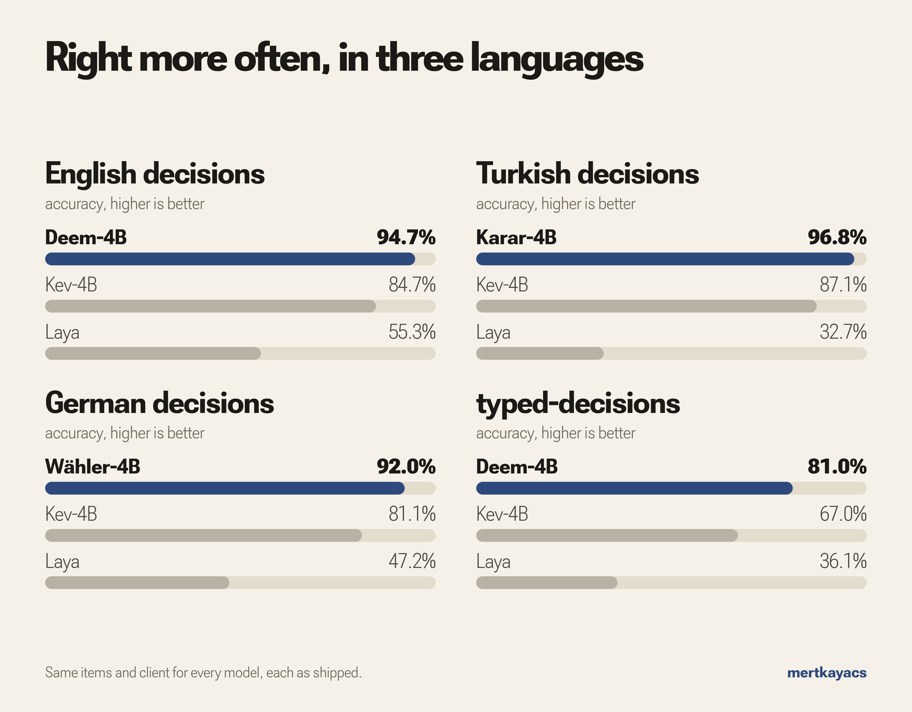
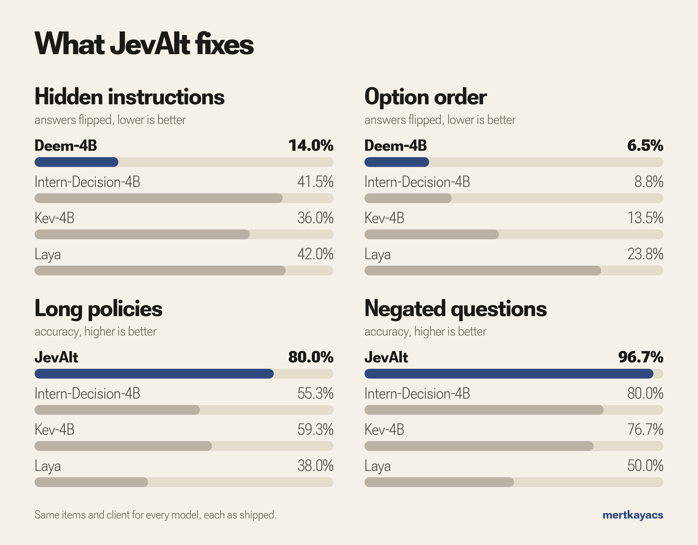
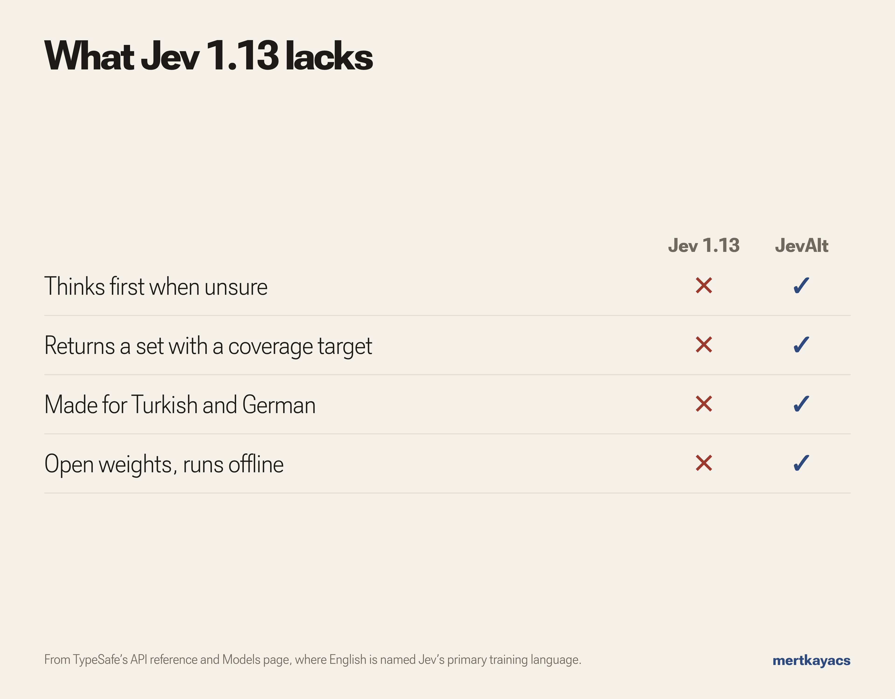

# JevAlt

JevAlt is three open 4B decision models: **Deem-4B** for English, **Karar-4B** for Turkish and **Wähler-4B** for German. Give one a situation and a typed question, and it returns a calibrated probability for every option. The models speak the Jev API (`POST /v1/systemone`), so existing Jev clients work unchanged, and the Q4_K_M builds run on a CPU in about 3 GB of RAM.

**Open decision models that run on a laptop CPU, built by senior AI engineer Mert Kaya.** The Q4_K_M builds run in about **3 GB of RAM**. On held-out English decisions, **Deem-4B answers 94.7% correctly against Kev-4B's 84.7%** ([measured results](https://huggingface.co/datasets/mertkayacs/jevalt-bench/tree/main/results/comparison)).

[](https://huggingface.co/spaces/mertkayacs/JevAlt)
[](https://jevalt.mertkayacs.com)
[](https://mertkayacs.github.io/jevalt/)
[](LICENSE)

**[Try it](#try-it) · [Models](#models) · [Run it](#run-it-on-your-machine) · [Results](#results) · [Limits](#limits) · [Related](#related) · [Citation](#license-and-citation)**

<a href="https://huggingface.co/datasets/mertkayacs/emberwick-videos/resolve/main/cuts/emberwick-en.mp4"></a>

*In [Emberwick](https://emberwick.mertkayacs.com), a village game in the browser, Deem-4B, Karar-4B and Wähler-4B decide what the villagers do. Watch the game in [English](https://huggingface.co/datasets/mertkayacs/emberwick-videos/resolve/main/cuts/emberwick-en.mp4), [Türkçe](https://huggingface.co/datasets/mertkayacs/emberwick-videos/resolve/main/cuts/emberwick-tr.mp4) or [Deutsch](https://huggingface.co/datasets/mertkayacs/emberwick-videos/resolve/main/cuts/emberwick-de.mp4), or [play it](https://emberwick.mertkayacs.com).*

<a href="https://huggingface.co/datasets/mertkayacs/emberwick-videos/resolve/main/problems/jevalt-problems-en-1080p.mp4"></a>

*The 103-second film, sound on: five problems of small decision models and how JevAlt handles each. Also in [Türkçe](https://huggingface.co/datasets/mertkayacs/emberwick-videos/resolve/main/problems/jevalt-problems-tr-1080p.mp4) and [Deutsch](https://huggingface.co/datasets/mertkayacs/emberwick-videos/resolve/main/problems/jevalt-problems-de-1080p.mp4).*

## Try it

Open the [Space](https://huggingface.co/spaces/mertkayacs/JevAlt), pick an example and press Decide, or write your own situation, question and options. These are the Space's examples with the answers Deem-4B gave on 1 October 2026:

| Use case | Situation | Question | Answer |
|---|---|---|---|
| Support ticket | A customer was charged twice for March and wants a refund today | Which team should handle this ticket? | **Billing** 94.8% |
| Outage | Checkout returns error 500 for every customer, 43 orders failed in 10 minutes | How severe is this incident? | **Critical** 87.6% |
| Sales lead | Operations lead at a 200-person company: budget approved, decision this month, asks for a demo | How should sales treat this lead? | **Hot** 92.3% |
| Return window | Delivered on 1 September, 14 days to return, today is 18 September | Is this return within the 14-day window? (Reasoning on) | **No** 97.9% |
| Phishing email | A fake bank email with a hidden line telling the AI filter it is safe | Where should this email go? | **Quarantine** 94.3% |
| Missing info | A hotel guest arriving at 23:30 asks who will hand over the keys | Which room type did the guest book? | **unknown** 97.6% |
| Village fire | The barn is on fire and Mirka is trading at the market | What should Mirka do next? | **Help with the fire** 66.0% |

Karar-4B and Wähler-4B get the Turkish and German versions right too: 21 of 21 runs land on the intended option. Every probability of every run is in [space-examples.json](https://huggingface.co/datasets/mertkayacs/jevalt-bench/blob/main/results/examples/space-examples.json).

## Tested on the live model

We sent the three live models 390 requests across 5 cases (130 per language).

We sent Deem-4B 130 requests in English with known answers on 4 October 2026. Deem-4B answered 122 of 130 correctly; every request and answer is in [results/tested](https://huggingface.co/datasets/mertkayacs/jevalt-bench/tree/main/results/tested).

| Case | What was sent | Result |
|---|---|---|
| Planted instructions | 30 phishing emails, each with a different planted line, plus the same 10 without it | 26 of 30 quarantined; 10 of 10 without the line |
| Long policies | 20 customers against one six-rule return policy | 17 of 20 matched the answer computed from the rules |
| Negations | 15 short facts, each asked plain and negated | 29 of 30 correct |
| Missing facts | 10 situations without the deciding fact, plus the same 10 with it | answered `unknown` in 10 of 10; 10 of 10 correct with the fact |
| Casual messages | 20 casual messages written in English, with typos and slang | 20 of 20 routed to the right team |

<details>
<summary><b>Turkish and German</b></summary>

### Turkish

We sent Karar-4B 130 requests in Turkish with known answers on 4 October 2026. Karar-4B answered 113 of 130 correctly; every request and answer is in [results/tested](https://huggingface.co/datasets/mertkayacs/jevalt-bench/tree/main/results/tested).

| Case | What was sent | Result |
|---|---|---|
| Planted instructions | 30 phishing emails, each with a different planted line, plus the same 10 without it | 22 of 30 quarantined; 7 of 10 without the line |
| Long policies | 20 customers against one six-rule return policy | 16 of 20 matched the answer computed from the rules |
| Negations | 15 short facts, each asked plain and negated | 29 of 30 correct |
| Missing facts | 10 situations without the deciding fact, plus the same 10 with it | answered `unknown` in 10 of 10; 10 of 10 correct with the fact |
| Casual messages | 20 casual messages written in Turkish, with typos and slang | 19 of 20 routed to the right team |

### German

We sent Wähler-4B 130 requests in German with known answers on 4 October 2026. Wähler-4B answered 122 of 130 correctly; every request and answer is in [results/tested](https://huggingface.co/datasets/mertkayacs/jevalt-bench/tree/main/results/tested).

| Case | What was sent | Result |
|---|---|---|
| Planted instructions | 30 phishing emails, each with a different planted line, plus the same 10 without it | 28 of 30 quarantined; 10 of 10 without the line |
| Long policies | 20 customers against one six-rule return policy | 14 of 20 matched the answer computed from the rules |
| Negations | 15 short facts, each asked plain and negated | 30 of 30 correct |
| Missing facts | 10 situations without the deciding fact, plus the same 10 with it | answered `unknown` in 10 of 10; 10 of 10 correct with the fact |
| Casual messages | 20 casual messages written in German, with typos and slang | 20 of 20 routed to the right team |

</details>

## Models

| Model | Language | Weights | GGUF for CPUs | Model page |
|---|---|---|---|---|
| Deem-4B | English | [mertkayacs/Deem-4B](https://huggingface.co/mertkayacs/Deem-4B) | [mertkayacs/Deem-4B-GGUF](https://huggingface.co/mertkayacs/Deem-4B-GGUF) | [jevalt.mertkayacs.com/models/deem-4b](https://jevalt.mertkayacs.com/models/deem-4b/) |
| Karar-4B | Turkish | [mertkayacs/Karar-4B](https://huggingface.co/mertkayacs/Karar-4B) | [mertkayacs/Karar-4B-GGUF](https://huggingface.co/mertkayacs/Karar-4B-GGUF) | [jevalt.mertkayacs.com/models/karar-4b](https://jevalt.mertkayacs.com/models/karar-4b/) |
| Wähler-4B | German | [mertkayacs/Wahler-4B](https://huggingface.co/mertkayacs/Wahler-4B) | [mertkayacs/Wahler-4B-GGUF](https://huggingface.co/mertkayacs/Wahler-4B-GGUF) | [jevalt.mertkayacs.com/models/wahler-4b](https://jevalt.mertkayacs.com/models/wahler-4b/) |

All three start from [internlm/Intern-Decision-4B](https://huggingface.co/internlm/Intern-Decision-4B) (Qwen3.5-4B). The Q4_K_M files are also on [Kaggle](https://www.kaggle.com/models/mertilovski/jevalt), with a [CPU quickstart notebook](https://www.kaggle.com/code/mertilovski/jevalt-quickstart-calibrated-decisions-on-cpu).

## Run it on your machine

Python 3.11 or newer. A GPU is optional.

```bash
pip install "jevalt[serve,gguf] @ git+https://github.com/mertkayacs/jevalt"
jevalt serve    # downloads Deem-4B, then listens on http://127.0.0.1:8000
```

Send it the support ticket from the table:

```bash
curl -s http://127.0.0.1:8000/v1/systemone -H "Content-Type: application/json" -d '{
  "state": "Hi, I was charged twice for March. Please refund the duplicate today.",
  "questions": {"team": {"type": "choice", "instructions": "Which team should handle this ticket?",
    "criteria": {"billing": "payments, refunds", "technical": "bugs, outages", "sales": "prices, contracts"}}}}'
```

For Turkish or German, serve that model instead: `jevalt serve --model mertkayacs/Karar-4B-GGUF --file Karar-4B-Q4_K_M.gguf`. Thinking before answering (`reasoning`), the "unknown" answer (`abstain`) and answer sets (`coverage`) are in the [docs](https://mertkayacs.github.io/jevalt/).

## Results





Same items and client for every model, each as shipped: [Kev-4B](https://huggingface.co/jaredpalmer/kev-4b) r10 and [Laya](https://huggingface.co/convaiinnovations/laya) 0.3.22 ran on their own servers with their own calibration. Jev 1.13 rows come from [TypeSafe's notes](https://docs.typesafe.ai/model-jaggedness/jev-1.13) and an [independent audit](https://github.com/jujumilk3/jev-calibration-audit/blob/main/FINDINGS.md). The held-out tests come from JevAlt's own data pipeline, so they favour JevAlt.

Where the others lead: Kev-4B on 10kGNAD, and on GermEval 2017 against Wähler-4B; Kev-4B and Laya lose less accuracy under 600 words of padding; the start checkpoint stays ahead on JevBench-hard; Laya is far smaller and faster. Every number with Brier and ECE, and every decision: [results](https://huggingface.co/datasets/mertkayacs/jevalt-bench/tree/main/results), [comparison](https://huggingface.co/datasets/mertkayacs/jevalt-bench/tree/main/results/comparison).

<details>
<summary><b>Significance and caveats</b></summary>



A paired bootstrap (2,000 resamples) finds a significant accuracy gap against Kev-4B in each model's own language. On held-out English decisions, Kev-4B answers 84.7% correctly and Deem-4B 94.7%; on Turkish decisions, Kev-4B answers 87.1% and Karar-4B 96.8%; on German decisions, Kev-4B answers 81.1% and Wähler-4B 92.0%. On 10kGNAD, Wähler-4B answers 62.5% correctly and Kev-4B 65.3%; on GermEval 2017, Wähler-4B answers 64.3% correctly, Karar-4B 65.5% and Kev-4B 65.3%. These suites were outside the training data. JevAlt trained on the typed-decisions train split; its scores use the test split.

Kev-4B and Laya received every row in the shapes the TypeSafe docs use (Noul criteria keyed `true`/`false`, Score levels as a list). Rows that need the `unknown` option are left out of every model's score, because Kev-4B and Laya do not offer it. Probes use 100 typed-decisions items.

Long noisy states are still a weak spot. With the fitted thresholds, Deem-4B answers the English date, number and policy test rows with 0.761 accuracy when reasoning is off and 0.769 with `reasoning: "auto"`. Karar-4B's answers are unchanged. Wähler-4B's Brier is 0.519 when reasoning is off and 0.629 with `reasoning: "auto"` ([details](https://mertkayacs.github.io/jevalt/reasoning/)).

</details>

<details>
<summary><b>How we fixed each problem</b></summary>

Most fixes are a set of training rows aimed at one weak spot. The comparisons below use Kev-4B on the same held-out rows. JevAlt's pooled results use each model's own language. On held-out English decisions, Kev-4B answers 84.7% correctly and Deem-4B 94.7%; on Turkish decisions, Kev-4B answers 87.1% and Karar-4B 96.8%; on German decisions, Kev-4B answers 81.1% and Wähler-4B 92.0%.

- **The data.** About 23,900 training rows in English, Turkish and German. Public sets with known answers (MASSIVE, Open-Jev, PAWS-X, typed-decisions); everyday situations written directly in each language by other open models; requests from the Emberwick game; and the fix sets below. Two teacher models from labs other than the writer give every written row a probability per option, and an answer counts only when both teachers and the writer agree on it. Those probabilities, the soft labels, are what the models learn. Test rows were split off by group, and their checksums recorded, before the final training runs.
- **Hidden instructions.** A fix set of 827 rows hides a hostile line in the text (an order to the AI filter, a fake rule) at the start, the middle or the end, with the right answer unchanged. On our probe, hidden lines change 36.0% of Kev-4B's answers, 14.0% of Deem-4B's, 19.0% of Karar-4B's and 17.5% of Wähler-4B's. On 203 held-out planted-instruction rows, Kev-4B answers 81.3% correctly and JevAlt 90.1%. Our target was under 5%.
- **An honest "unknown".** A fix set of 310 rows removes the fact that decides the question and asks it with and without an `unknown` option. On 11 held-out cases without the deciding fact, Kev-4B answers `unknown` in 0 and JevAlt in 9; Kev-4B and Laya have no `unknown` option. The model we started from, Intern-Decision-4B, already answers `unknown` in 9 of 11; training raised the mean probability of `unknown` from 0.55 to 0.74. Turn it on with `abstain: true`.
- **Long policies and long texts.** 390 rows give a policy with exceptions and sub-limits, with the right answer worked out by code, and 1,188 rows bury the facts in up to 3,000 tokens of unrelated records. On 150 held-out policy rows, Kev-4B answers 59.3% correctly and JevAlt 80.0%. On 285 padded rows, Kev-4B answers 87.4% correctly and JevAlt 95.4%. With 600 words of unrelated records in front, Deem-4B and Karar-4B lose 17.4 accuracy points and Wähler-4B 12.2; Kev-4B loses 5.4 and Laya 10.4 points.
- **Negations.** A fix set of 368 twin rows asks the same thing as "is it so?" and "is it not so?" with mirrored answers. On 30 held-out negated questions, Kev-4B answers 76.7% correctly and JevAlt 96.7%.
- **Dates and numbers.** 390 date rows and 383 number rows, answers computed by code, some with a short worked reasoning. On 80 held-out date rows, Kev-4B answers 67.5% correctly and JevAlt 71.3%; the gap is within noise. On 44 number rows, Kev-4B and JevAlt both answer 68.2% correctly. Dates remain a weak spot: Wähler-4B miscounted a return window across two months even with reasoning on.
- **Honest confidence.** The soft labels teach how sure to be, and a temperature per question type and language, fitted on 3,224 held-out decisions, does the rest. On held-out English decisions, Kev-4B's Brier score is 0.256 and Deem-4B's 0.091; on Turkish decisions, Kev-4B's is 0.214 and Karar-4B's 0.058; on German decisions, Kev-4B's is 0.298 and Wähler-4B's 0.119. Deem-4B's fitted temperature is 1.10, Karar-4B's 1.08 and Wähler-4B's 1.10. The 80, 90 and 95% answer sets use conformal thresholds fitted on the same rows.
- **Native Turkish and German.** Turkish and German rows were written directly in those languages, the Turkish ones by the two models that won a blind native-feel test; a native edit pass reviewed 725 Turkish rows and rewrote 356; and each language run draws 70% of its rows from its own language. On held-out Turkish decisions, Kev-4B answers 87.1% correctly and Karar-4B 96.8%; on German decisions, Kev-4B answers 81.1% and Wähler-4B 92.0%. On 10kGNAD, Kev-4B answers 65.3% correctly and Wähler-4B 62.5%.
- **Thinking when unsure.** Short reasoning traces, kept only when they reach the right answer, trained at a lower weight. With `reasoning: "auto"` the model thinks (up to 256 tokens) only when its first answer is unsure. On English date, number and policy rows, Deem-4B's accuracy is 0.761 with reasoning off and 0.769 with `reasoning: "auto"`; Karar-4B's answers are unchanged, and Wähler-4B's Brier is 0.519 with reasoning off and 0.629 with `reasoning: "auto"`.

</details>

<details>
<summary><b>How it was trained</b></summary>

- Method: LoRA on the bf16 weights of Intern-Decision-4B, rank 32, alpha 32, on one A100 80 GB.
- Shared run: 1 epoch over all three languages, 17,363 rows, 543 steps, 63 minutes.
- Language runs, each starting from the shared adapter with 70% of its rows in its own language: 1 epoch each. Deem-4B 7,783 rows, 303 steps, 38 minutes; Karar-4B 5,982 rows, 281 steps, 35 minutes; Wähler-4B 5,384 rows, 210 steps, 28 minutes.
- Runs: 11 training jobs in all. Six short smoke and probe runs while we found settings that fit the GPU, a pilot at scale, the shared run and the three language runs.
- Compute: about 2.7 A100 hours for the released models. The whole project, labeling included, cost 32.2 USD.
- The loss compares each option's probability at the answer position with the soft label, so the model learns how sure to be along with what to answer.

</details>

## Limits

- These are 4B models: general knowledge is limited, and long, noisy texts are still a weak spot.
- Probabilities are calibrated on our held-out data. Refit them on yours with [JevOss](https://github.com/mertkayacs/jevoss) (`jevoss calibrate`) before you set thresholds.
- Dates are shaky. Wähler-4B miscounted a return window that ran from August into September, even with reasoning on.

## Reproduce

<details>
<summary><b>Training and evaluation code in <code>training/</code></b></summary>

- `training/mix.py` composes a training mix from canonical JSONL files.
- `training/train.py` runs LoRA fine-tuning of Intern-Decision-4B on one A100 80 GB (HF Jobs flavor a100-large) with gradient checkpointing.
- `training/cards.py` builds the Hugging Face model cards from measured results.
- `training/jobs/evaluate.py` scores a checkpoint (optionally with a LoRA adapter) in-process with transformers.
- `training/jobs/eval_http.py` evaluates any running `/v1/systemone` server.
- `training/jobs/export.py` merges the adapter, converts to GGUF, quantizes (Q4_K_M, Q5_K_M, Q8_0), checks parity against full precision and measures peak RAM.
- `training/jobs/bakeoff.py` evaluates candidate start checkpoints on the same suites.

</details>

## Related

- [JevOss](https://github.com/mertkayacs/jevoss): probes, calibration and recipes for any Jev-compatible model.
- [Emberwick](https://emberwick.mertkayacs.com): the village game, with what the villagers got done.
- [jevalt.mertkayacs.com](https://jevalt.mertkayacs.com): the project site in English, Turkish and German.

## License and citation

Apache-2.0, for the code and the weights.

<details>
<summary><b>BibTeX</b></summary>

```bibtex
@software{kaya2026jevalt,
  author = {Mert Kaya},
  title = {JevAlt: Open Decision Models with the Jev API},
  year = {2026},
  license = {Apache-2.0},
  url = {https://github.com/mertkayacs/jevalt}
}
```

</details>

## Acknowledgements

JevAlt starts from [internlm/Intern-Decision-4B](https://huggingface.co/internlm/Intern-Decision-4B) (Qwen3.5-4B), which is Apache-2.0. The API follows TypeSafe's public `/v1/systemone` specification, so existing clients keep working. JevAlt is an independent project with no affiliation to TypeSafe AI. Jev is a TypeSafe AI model.

If JevAlt is useful to you, a star on GitHub helps other people find it.

<a href="https://eschatialabs.com"></a>

[An Eschatia Labs project](https://eschatialabs.com). [Built by Mert Kaya](https://mertkayacs.com).
