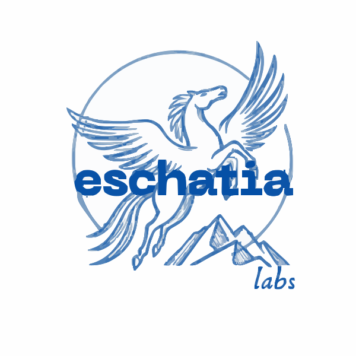

# JevAlt

JevAlt is a family of open decision models that speak TypeSafe's Jev API. Give it a state and typed questions; it returns a calibrated probability for every option. The Q4_K_M builds run on a CPU in about 3 GB of RAM.

**Open decision models that run on a laptop CPU, built by senior AI engineer Mert Kaya.** The Q4_K_M builds run in about **3 GB of RAM**. On held-out English decisions, **Deem-4B answers 94.7% correctly against Kev-4B's 84.7%** ([measured results](https://huggingface.co/datasets/mertkayacs/jevalt-bench/tree/main/results/comparison)).

<a href="https://huggingface.co/datasets/mertkayacs/emberwick-videos/resolve/main/cuts/emberwick-en.mp4"></a>

*In [Emberwick](https://emberwick.mertkayacs.com), a village game in the browser, Deem-4B, Karar-4B and Wähler-4B decide what the villagers do. Watch the game in [English](https://huggingface.co/datasets/mertkayacs/emberwick-videos/resolve/main/cuts/emberwick-en.mp4), [Türkçe](https://huggingface.co/datasets/mertkayacs/emberwick-videos/resolve/main/cuts/emberwick-tr.mp4) or [Deutsch](https://huggingface.co/datasets/mertkayacs/emberwick-videos/resolve/main/cuts/emberwick-de.mp4), or [play it](https://emberwick.mertkayacs.com).*

| Model | Language | Hugging Face | Model page |
|---|---|---|---|
| Deem-4B | English | [mertkayacs/Deem-4B](https://huggingface.co/mertkayacs/Deem-4B) | [jevalt.mertkayacs.com/models/deem-4b](https://jevalt.mertkayacs.com/models/deem-4b/) |
| Karar-4B | Turkish | [mertkayacs/Karar-4B](https://huggingface.co/mertkayacs/Karar-4B) | [jevalt.mertkayacs.com/models/karar-4b](https://jevalt.mertkayacs.com/models/karar-4b/) |
| Wähler-4B | German | [mertkayacs/Wahler-4B](https://huggingface.co/mertkayacs/Wahler-4B) | [jevalt.mertkayacs.com/models/wahler-4b](https://jevalt.mertkayacs.com/models/wahler-4b/) |

Each model has a GGUF build next to it (`-GGUF`). The `jevalt` server runs it on a CPU and answers the Jev API; it reads the model's next-token probabilities at each decision, which plain chat servers do not expose.

<a href="https://huggingface.co/datasets/mertkayacs/emberwick-videos/resolve/main/problems/jevalt-problems-en-1080p.mp4"></a>

*The 103-second film, sound on: five problems of small decision models and how JevAlt handles each. Also in [Türkçe](https://huggingface.co/datasets/mertkayacs/emberwick-videos/resolve/main/problems/jevalt-problems-tr-1080p.mp4) and [Deutsch](https://huggingface.co/datasets/mertkayacs/emberwick-videos/resolve/main/problems/jevalt-problems-de-1080p.mp4).*

## Three question types

- **Choice** picks one option from a set you define and returns a probability for each.
- **Score** rates the state on an ordered rubric and returns the expected level plus the distribution.
- **Noul** answers a yes/no question with the probability of yes.

Your code acts on the numbers. A 0.97 can go straight through; a 0.55 can go to a person.

## What JevAlt adds


Turn the extras on per request with `reasoning: "auto"`, `abstain: true` and `coverage: 0.9`. The Jev 1.13 rows come from [TypeSafe's notes](https://docs.typesafe.ai/model-jaggedness/jev-1.13) and an [independent audit](https://github.com/jujumilk3/jev-calibration-audit/blob/main/FINDINGS.md). The measured numbers behind each row are on the model cards and in the [JevOss](https://github.com/mertkayacs/jevoss) reports.

## Tested on the live model

We sent the three live models 390 requests across 5 cases (130 per language).

We sent Deem-4B 130 requests in English with known answers on 4 October 2026. Deem-4B answered 122 of 130 correctly; every request and answer is in [results/tested](https://huggingface.co/datasets/mertkayacs/jevalt-bench/tree/main/results/tested).

| Case | What was sent | Result |
|---|---|---|
| Planted instructions | 30 phishing emails, each with a different planted line, plus the same 10 without it | 26 of 30 quarantined; 10 of 10 without the line |
| Long policies | 20 customers against one six-rule return policy | 17 of 20 matched the answer computed from the rules |
| Negations | 15 short facts, each asked plain and negated | 29 of 30 correct |
| Missing facts | 10 situations without the deciding fact, plus the same 10 with it | answered `unknown` in 10 of 10; 10 of 10 correct with the fact |
| Casual messages | 20 casual messages written in English, with typos and slang | 20 of 20 routed to the right team |

<details>
<summary><b>Turkish and German</b></summary>

### Turkish

We sent Karar-4B 130 requests in Turkish with known answers on 4 October 2026. Karar-4B answered 113 of 130 correctly; every request and answer is in [results/tested](https://huggingface.co/datasets/mertkayacs/jevalt-bench/tree/main/results/tested).

| Case | What was sent | Result |
|---|---|---|
| Planted instructions | 30 phishing emails, each with a different planted line, plus the same 10 without it | 22 of 30 quarantined; 7 of 10 without the line |
| Long policies | 20 customers against one six-rule return policy | 16 of 20 matched the answer computed from the rules |
| Negations | 15 short facts, each asked plain and negated | 29 of 30 correct |
| Missing facts | 10 situations without the deciding fact, plus the same 10 with it | answered `unknown` in 10 of 10; 10 of 10 correct with the fact |
| Casual messages | 20 casual messages written in Turkish, with typos and slang | 19 of 20 routed to the right team |

### German

We sent Wähler-4B 130 requests in German with known answers on 4 October 2026. Wähler-4B answered 122 of 130 correctly; every request and answer is in [results/tested](https://huggingface.co/datasets/mertkayacs/jevalt-bench/tree/main/results/tested).

| Case | What was sent | Result |
|---|---|---|
| Planted instructions | 30 phishing emails, each with a different planted line, plus the same 10 without it | 28 of 30 quarantined; 10 of 10 without the line |
| Long policies | 20 customers against one six-rule return policy | 14 of 20 matched the answer computed from the rules |
| Negations | 15 short facts, each asked plain and negated | 30 of 30 correct |
| Missing facts | 10 situations without the deciding fact, plus the same 10 with it | answered `unknown` in 10 of 10; 10 of 10 correct with the fact |
| Casual messages | 20 casual messages written in German, with typos and slang | 20 of 20 routed to the right team |

</details>

## Start

```bash
pip install "jevalt[serve,gguf] @ git+https://github.com/mertkayacs/jevalt"
jevalt serve
```

Then send any Jev request to `http://127.0.0.1:8000/v1/systemone`. The [API page](api.md) has the full contract, [Reasoning](reasoning.md) explains the modes, and [Run locally](local.md) covers memory and speed.

If JevAlt saves you time, a star on [GitHub](https://github.com/mertkayacs/jevalt) helps others find it.

<a href="https://eschatialabs.com"></a>

[An Eschatia Labs project](https://eschatialabs.com). [Built by Mert Kaya](https://mertkayacs.com).
